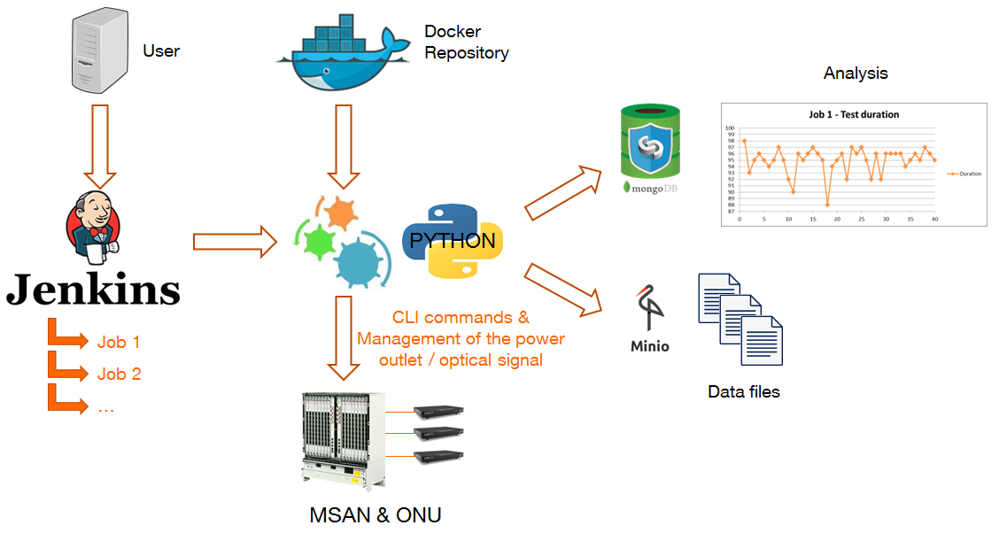

% XtestingCI Gate
% <cedric.ollivier@orange.com>
% 2025/06/12

# XtestingCI

### An ansible role

- eases deploying anywhere plug-and-play CI/CD toolchains in a few commands
- leverages on the common test case execution proposed by Xtesting, the
  test integration framework
- supports multiple components such as Jenkins and GitLab CI/CD (test
  schedulers) and multiple deployment models such as all-in-one or distributed
  services

**A key help for our automation journey!**

### Xtesting CI/CD toolchain

### Well reused

  - [GSMA NG.133](https://www.gsma.com/newsroom/wp-content/uploads/NG.133-v2.0-11.pdf) and
    [NG.139](https://docs.anuket.io/projects/RA2/en/stable-quinnipiac/chapters/chapter06.html)
  - [Orange RFP](https://www.youtube.com/watch?v=YheJ51kbcU8)
  - [Orange Cloud product and deployment verification](https://www.youtube.com/watch?v=YheJ51kbcU8)
  - Orange Network Integration Factory
  - [Xtesting Training courses](https://www.linkedin.com/pulse/learn-xtesting-using-interactive-browser-based-labs-c%C3%A9dric-ollivier)

**Try it, and you will love it!**

### Main objectives

- install and configure all CI services from scratch
- support RHEL, Ubuntu, Debian and Alpine (16 active releases in total)
- support multiple containerization technologies (Docker, Podman, Kubernetes)
- offer 20+ deployment scenarios from all-in-one in your server to full
  distributed corporate services
- enable local or remote deployment, with proxies or without proxies

**Huge verification matrix!**

### A few technical details

- all services run in containers (i.e. Docker, Podman, Kubernetes)
  and are accessible via IP addresses
- data persistence is maintained by mounting volumes
- all installation and configuration steps are decoupled to support the
  various deployment models
- XtestingCI installs only the dependencies required for each service

### Technical challenges

- Ansible requires many Python libraries which must be managed
  and controlled
- Ansible depends on low-level commands which may be missing (e.g. iproute,
  lsb_release, ...)
- they are a few bugs in the GNU/Linux distribution packages (see
  [Incompatibility between py3-requests and ansible in Alpine](https://gitlab.alpinelinux.org/alpine/aports/-/issues/16984))
- the distributions don't offer the same Python packages, which requires many
  Ansible conditions

**Impossible to verify by hand!**

### Maintenance challenges

- a new release is frequently out (i.e. Alpine releases every 6 months)
- RHEL updates Ansible and then its needed Python version 
- CentOS is no longer a downstream project which required to switch to
  RockyLinux
- the stable Ansible collections require the latest python versions
- even pip and setuptools may destroy a frozen release

**XtestingCI must be continuously verified!**

# XtestingCI Gate

### Setup

- Anuket CI/CD toolchain (Gerrit + Jenkins)
- 1 server used in the Anuket data center
- Jenkins-job-builder which takes simple descriptions of Jenkins jobs in YAML
  which allows leveraging
  - YAML anchors
  - Job Templates

**~500 lines to generate 1132 jobs**

### A verification job

- clean all the resources created by the previous job
- run the right container as privileged, using the host's network stack and
  binding:
  - /run to access both Podman and Docker sockets
  - /data to access the configuration files
  - helm and docker configuration files to avoid Docker Hub pull rate limits
- install Ansible, clone XtestingCI and execute the test playbook in the
  container

### Gating metrics and results

- 30+ changes published to implement the new Gates
- many bugs detected such as:
  - [Six must be installed in rhel 8 when kubernetes too](https://github.com/collivier/ansible-role-xtesting/commit/934ecc2d0f7ce1c53fb863246f01c9a0dd53e803)
  - [Install py3-requests in any case](https://github.com/collivier/ansible-role-xtesting/commit/40b5b0b17bc23dc897fbf50e221fe9f6acd73506)
  - [community.docker must be updated if Focal](https://github.com/collivier/ansible-role-xtesting/commit/157134bbed7c32e15b96a3d3ba359adde97e3089)
  - [tag + digest requires podman >= 3.3](https://github.com/collivier/ansible-role-xtesting/commit/ff9fb53d5df862aa22fa9235e9ba24a040be07fa)
  - [Improve podman logics](https://github.com/collivier/ansible-role-xtesting/commit/44844e64080a11f3d057f459a89e54a52c8b3280)

**And updating XtestingCI is so much easier**

### current limits

- Podman client and server versions must be compatible
- running all the verification jobs ends after weeks and additional servers
  should be added
- a few jobs must be also executed before merge to detect maximum of bugs as
  early as possible

**The gate must be always improved**

# Conclusion

### Takeaways

- strong automated code verification speeds up the development and
  dramatically reduces the number of bugs
- a significant effort was made during the development cycle of
  XtestingCI 5.0 and it was worth it
- the gates must be continuously improved and its development never ends

# Thank You!
